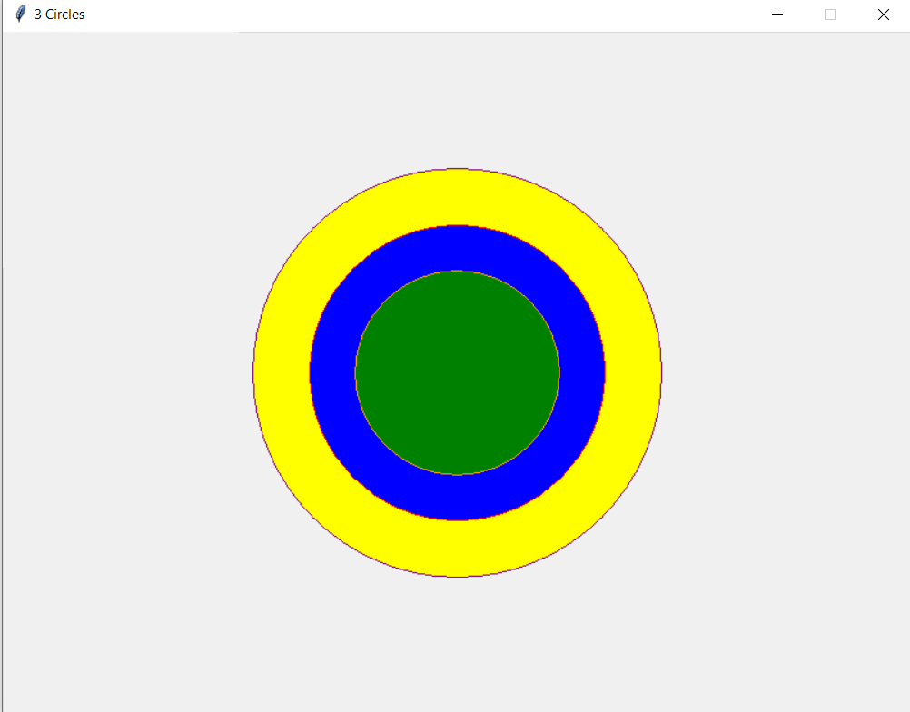
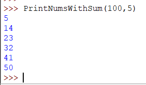
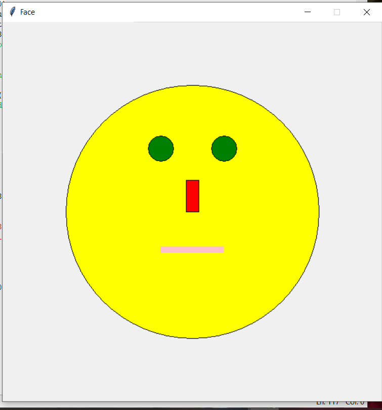

# 🎨 Python Graphics Mini Project

---

## 📌 Description
A Python mini project created as a final course assignment.  

The project includes three functions:
- 🎯 drawing three nested circles  
- 🔢 printing numbers whose digit sum equals a given value  
- 🙂 drawing a face using basic graphics shapes  

---

## 🛠️ Technologies
- Python 3  
- graphics.py  

---

## ⚙️ Functions
- `draw3Circles(n1, n2, n3)`  
- `PrintNumsWithSum(n, m)`  
- `DrawFace(eye1, eye2, mouth, noise)`  

---

## 🖼️ Screenshots
The `screenshots` folder contains output images for all three functions.  

---

## 📝 Notes
This project was originally developed and tested using **Python 3.9** with the **graphics.py** library.  

---

## Screenshots

### draw3Circles

### PrintNumsWithSum

### DrawFace

